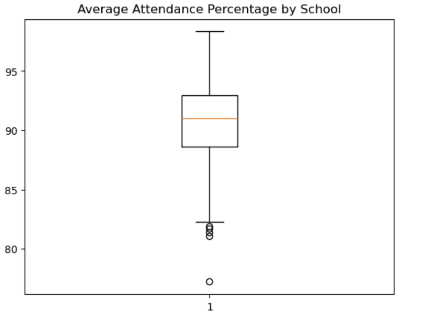
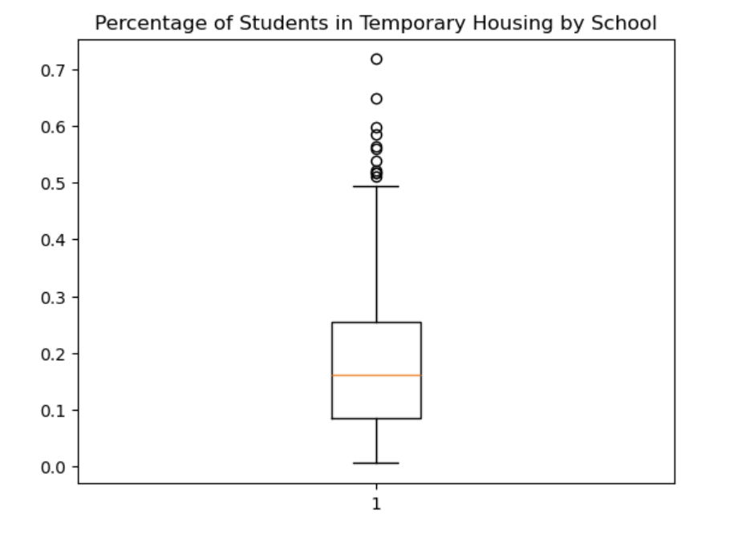
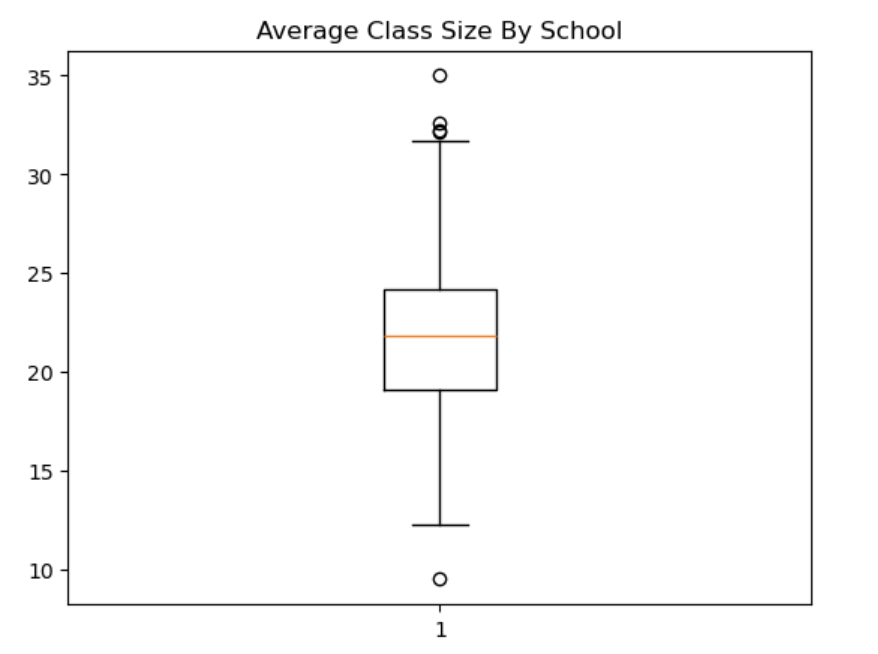
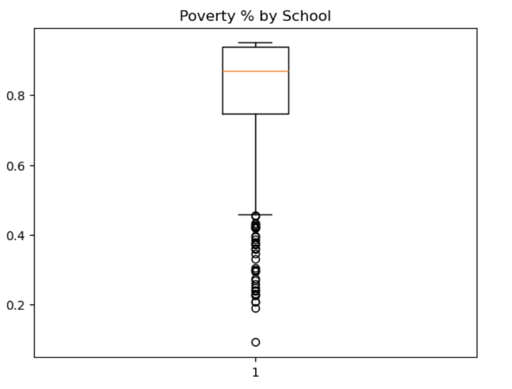
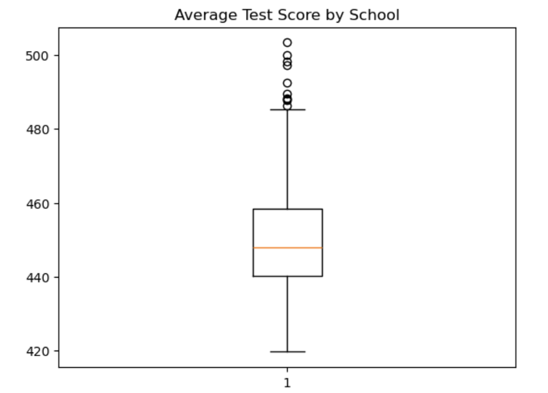
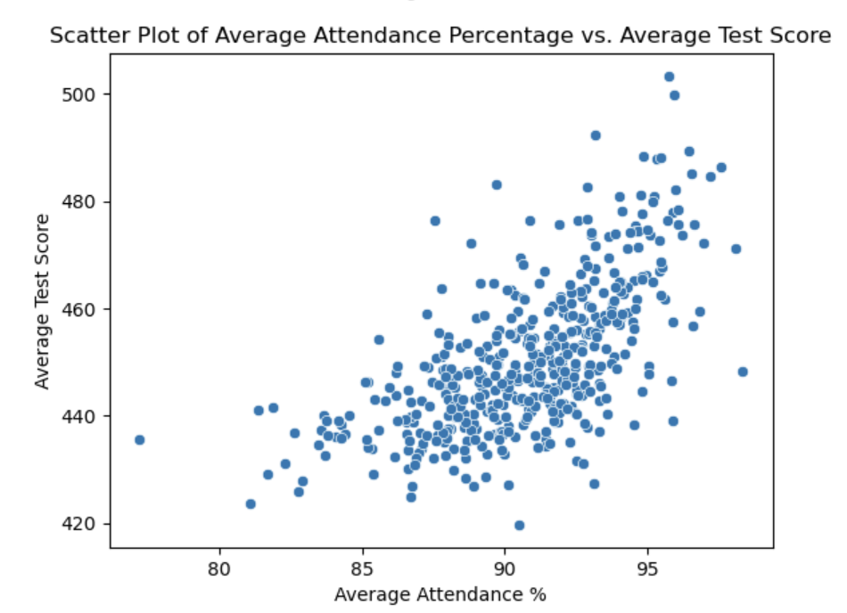
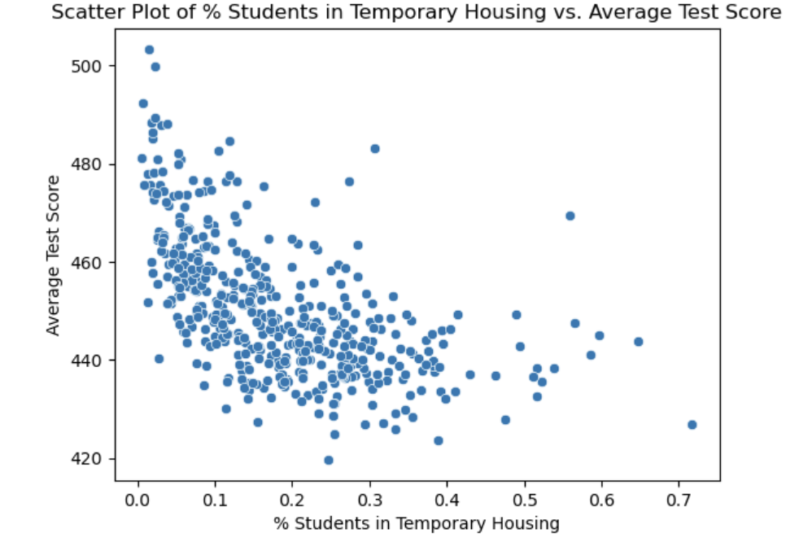
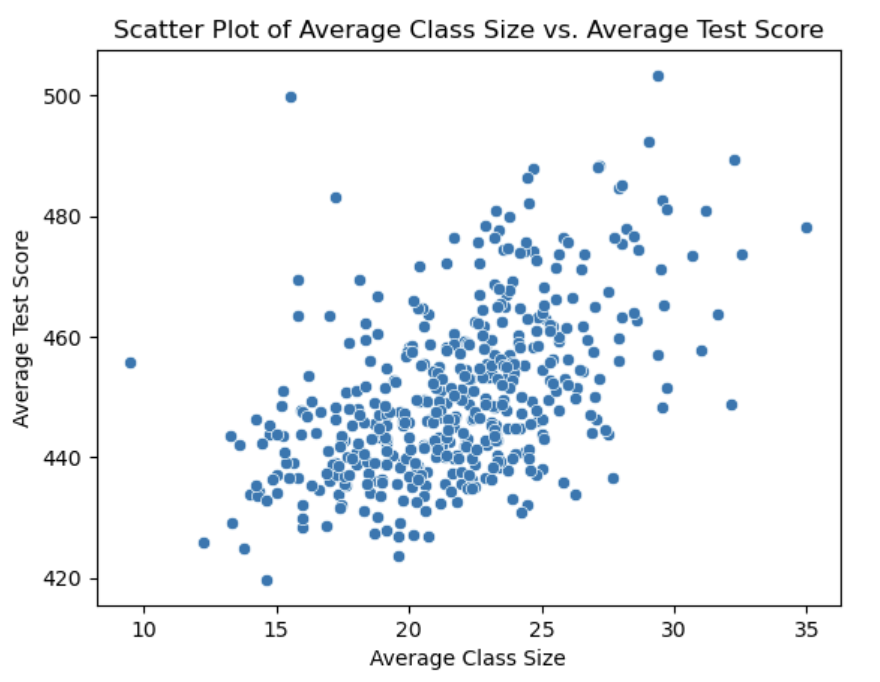
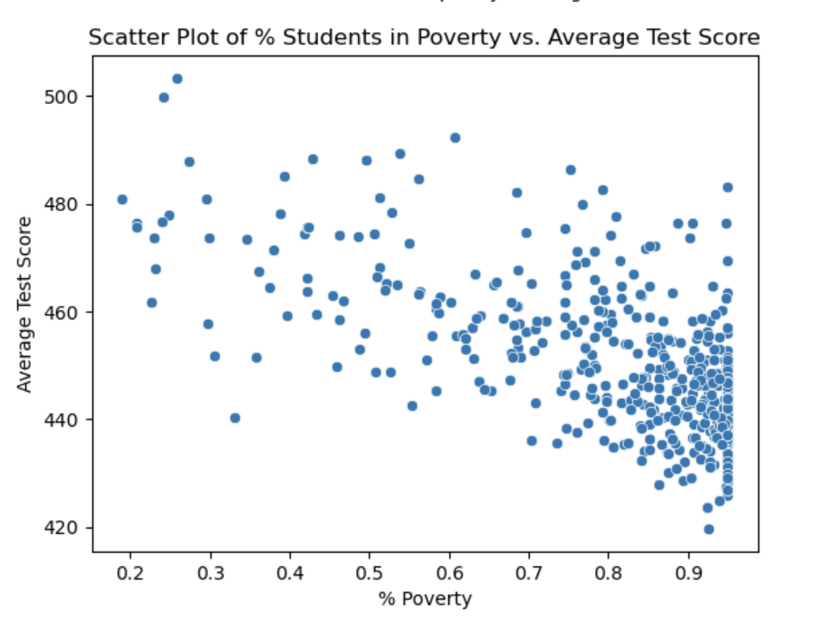

# Overview of Project

New York City Public Schools has publicly available data on its schools and students. I studied four factors to determine correlation with math test scores based on data from the 2024-2025 school year. 

## Four Factors Considered for Each Middle School
- Average Class Size
- Average Attendance Percentage
- Percentage of Students in Temporary Housing 
- Percentage of Students Classified as Living in Poverty

---

# Data Retrieval

- Each variable including the test scores was downloaded to an excel file from the NYCPS website. 

- I cleaned the data using Python, and I used Pandas to create a data frame that included the average test score, average class size, attendance percentage, temporary housing percentage, and poverty percentage for each school. 

- Prior to linear regression I created box and scatter plots.

---

# Box Plots

---
# Scatter Plots

---
# Linear Regression

- I used linear regression with Test Scores as the dependent variable and the other variables as independent variables. 

- My coefficients for Average Class Size, Average Attendance %, % Students in Temporary Housing, and % Poverty were:
0.52, 1.65, -13.25, and -20.87 collectively. 

- The R² Score of 0.60 indicates a moderate to strong linear relationship between the independent and dependent variables. 

---
# Implications for Stakeholders

- An implication for educational researchers is to analyze the effectiveness of specific attendance policies using a differences in differences outcomes model.

- An implication for educators and school boards is to invest more time and money into helping students living in poverty or in temporary housing learn important content. These students may benefit from extra structure or scaffolding in the classroom because they may have more barriers to success. 

---
# Ethical, legal, societal implications

- A possible ethical implication is that schools with higher percentages of poverty may have lower quality of education due to the correlation with lower math test scores. 

- A possible legal implication is that lawmakers should create intervention programs for schools with lower attendance percentages. 

- A possible societal implication is that students living in poverty may be more likely to have lower math performance which could lead to limited future options, like careers or education. 

