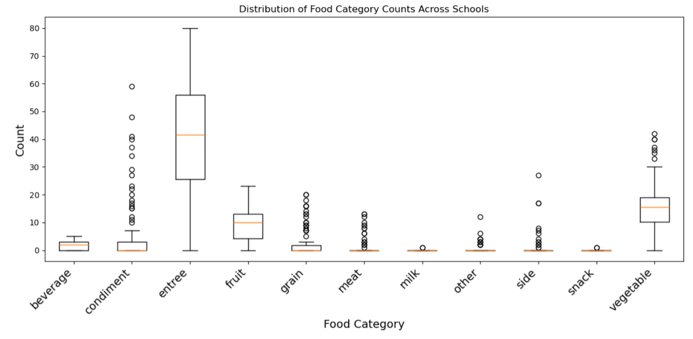

# Nutrislice
- Nutrislice is a platform to publicize school lunch menus for students and parents 

- Used schools that upload  menus to Nutrislice in order to standardize the data
  - About 1/4 of PA school districts use Nutrislice
  


### Which Schools use Nutrislice?
- Retrieved a list of PA school districts from the Commonwealth of PA Department of Education website

- In order to determine which schools use Nutrislice, we webscrabed using Selenium. 
  - We searched for each school district on Nutrislice and saved the results that came up

---


```{r eval=FALSE}
driver = webdriver.Chrome()
driver.get("https://lookup.nutrislice.com/en/")
wait = WebDriverWait(driver, 10)

all_results = []
schools_nutri = []
for school in school_districts:
    # Locating search box
    search_box = driver.find_element(By.ID, "org-input")
    time.sleep(2)
    # Clear last search
    search_box.clear()
    search_box.send_keys(school)
    search_box.send_keys(Keys.RETURN)

    time.sleep(1)
    
    
    options = driver.find_elements(By.CSS_SELECTOR, "mat-option")
    for opt in options:
        #Save all results to a list
        all_results.append(opt.text)
        schools_nutri.append(school)
driver.quit() 
```

---
# Scraping Links to Nutrislice Menus
- After obtaining the links to the Nutrislice menu for each PA school, we had to obtain the API links to each school lunch menu.

- There was a formula for determining the API link, so we automated this process
  - https://<mark>tmsd</mark>.api.nutrislice.com/menu/api/weeks/school/<mark>tussey-mountain-high</mark>/menu-type/lunch/2026/03/01/
  
  
  - The highlighted text is what changed for each school, but we were able to retrieve that text from regular link


---
# API Link Building 
```{r eval=FALSE}
# Getting school link domains using links list
for link in links:
    domains = [link[8:link.index(".")] for link in links]


#Getting school name from the link
for link in links:
    schools  = 
    [link.split("menu/")[1].split("/lunch")[0] for link in links]


#Building API link using original link, school name, and domain name
api_links=[]
count=-1
for domain in domains:
    count+=1
    api_link = ("https://" + domain + 
    ".api.nutrislice.com/menu/api/weeks/school/" +
     schools[count] + "/menu-type/lunch/2026/03/01/")
    api_links.append(api_link)
    
```
---
# Daily Items API Links
- Some of the menus were held in another API link for daily menu items. 
- There was a formula for determining this API link too, but it involved getting an additional API link first to determine school and menu code. 

```{r eval=FALSE}
api_links_messages=[]
for link in message_urls:
    #After retrieving the ids from other API links we built 
    #the new API url using lists of these elements
    link = link + "/messages/school/" + str(
    school_ids[message_urls.index(link)]) + "/menu-type/" + 
    str(menu_ids[message_urls.index(link)]) +"/"
    api_links_messages.append(link)
```
- Example link for one school
  - https://<mark>bedfordasd</mark>.api.nutrislice.com/menu/api/messages/school/<mark>7049</mark>/menu-type/<mark>8719</mark>/
  
  
  - The highlighted text changed for each school. The numbers were scraped from other APIs and the school name came from original school link
---

# Scraping Menu Items
- __Developed two functions for scraping Nutrislice API requests__

- __The JSON structure was different for both menu types (the two different API links for each school)__

- __Main menu__
  - Looped over each week’s unique API request
    
```{r eval=FALSE}
    date_map = {
        'week_1': "01",
        'week_2': "08",
        'week_3': "15",
        'week_4': "22",
        'week_5': "29” }
        
```
        
 

- Toggled menu contained in a separate API request
  
  - Sometimes contained items offered daily throughout the month


- Appended the folloowing items to a datam frame for each high school and middle school 


---
```{r eval=FALSE, paged.print=FALSE}
all_rows.append({"school_name": school_name,
                "menu_id": menu_id,
                "date": date,
                "food_id": food.get("id"),
                "food_name": food.get("name"),
                "category": category,
                "ingredients": food.get("ingredients"),
                "cal": nutrition.get("calories"),
                "g_fat": nutrition.get("g_fat"),
                "g_sat_fat": nutrition.get("g_saturated_fat"),
                "g_trans_fat": nutrition.get("g_trans_fat"),
                "mg_cholesterol": nutrition.get("mg_cholesterol"),
                "g_carbs": nutrition.get("g_carbs"),
                "g_added_sugar": nutrition.get("g_added_sugar"),
                "g_sugar": nutrition.get("g_sugar"),
                "mg_potassium": nutrition.get("mg_potassium"),
                "mg_sodium": nutrition.get("mg_sodium"),
                "g_fiber": nutrition.get("g_fiber"),
                "g_protein": nutrition.get("g_protein"),
                "mg_iron": nutrition.get("mg_iron"),
                "mg_calcium": nutrition.get("mg_calcium"),
                "mg_vitamin_c": nutrition.get("mg_vitamin_c"),
                "iu_vitamin_a": nutrition.get("iu_vitamin_a"),
                "mg_vitamin_d": nutrition.get("mg_vitamin_d"),
                "serving_size_amount": serving_size_info.get("serving_size_amount"),
                "serving_size_unit": serving_size_info.get("serving_size_unit"),
            })
 
```

---
# EDA



---
# EDA Findings

- __Entrees have the highest count__
  - mean is around 41 with a max near 80 (averaging around 1-2 entrees per day)
  
  - school differ greatly on the number of entrees they offer (some may not be filling out the category section)
  
- __Vegetables and fruit are the next most common__ 
  - Veggies median is around 15 (likely repeat throughout the month)
  
  - Fruit median is around 10 (likely repeat throughout the month)
  
- __Most other categories are heavily right-skewed__
  - Condiments, grain, meat, milk, sides, and snacks have medians near 0 and all of the categories lower limits are zero
  
  - This is an indicator that many schools might not completely categorize their food items
  
  - This is a data inconsistency so "categories" is not a good variable to use for conducting our analysis
---

# Next steps:  Nutritional feature engineering
- __calculating nutrition scores per meal__
	- positive weights for fiber and protein offered per day
	
	- negative weights for sodium, saturated fats, and added sugars
	
- daily diversity of food items averaged per school

- __Categorizing foods based on food item name rather than the given category__
	- General Tso's chicken would go from entree to meat
	
	- use LLM for categorizing
	
- __incorporating district level income data__

	- Do lower income schools have lower food diversity?
	- Do higher income schools have better nutrition scores?
	
- __Comparative case studies between high income and low income school menus__


